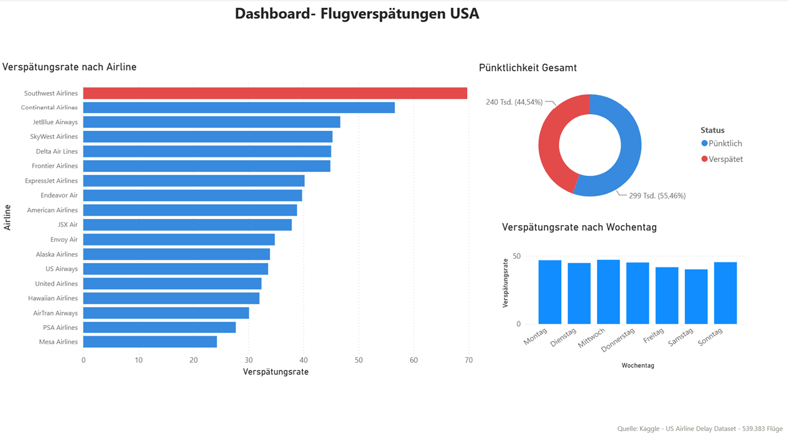

# ✈️ Flugverspätungsanalyse USA

Analyse von 539.383 Flügen in den USA – Welche Airlines und Wochentage haben die höchsten Verspätungsraten?  
Datenquelle: Kaggle – Airline Delay Dataset

## 🎯 Fragestellung
Welche Airlines und Wochentage haben die höchsten Verspätungsraten im US-Luftverkehr?

## 📊 Ergebnisse
- **Southwest Airlines (WN)** hat mit 69.8% die höchste Verspätungsrate
- **Mesa Airlines (YV)** ist mit 24.3% die pünktlichste Airline
- **Mittwoch** hat die höchste Verspätungsrate (47.1%)
- **Samstag** ist der pünktlichste Reisetag (40.1%)
- Durchschnittliche Verspätungsrate: 39.7% (Airline) / 44.4% (Wochentag)

## 🛠️ Tools & Technologien
- Python (Pandas, Matplotlib)
- Jupyter Notebook
- VS Code

## 📁 Dateien
- `analyse.ipynb` – Komplette Analyse mit Code und Visualisierungen
- `verspaetung_airline.png` – Verspätungsrate nach Airline
- `verspaetung_wochentag.png` – Verspätungsrate nach Wochentag
## Power BI Dashboard

📥 📥 [Dashboard herunterladen](https://github.com/FerhatYasar1/flugverspaetungen-usa-analyse/raw/main/Dashboard_Verspaetung_USA_Airlines.pbix)

## 👤 Autor
Ferhat Yasar – Data Analyst | Verkehr & Luftfahrt  
[LinkedIn](https://www.linkedin.com/in/ferhat-yasar-37499940a)
